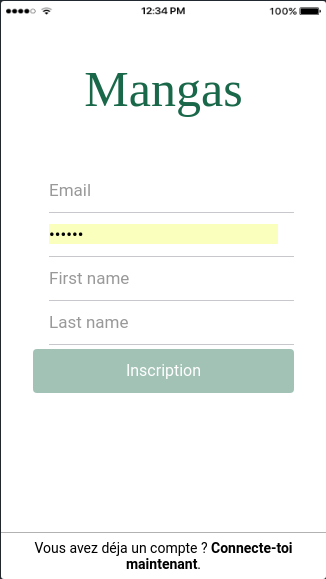
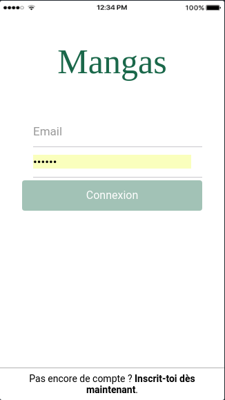
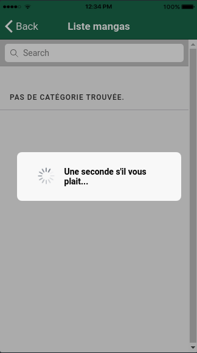
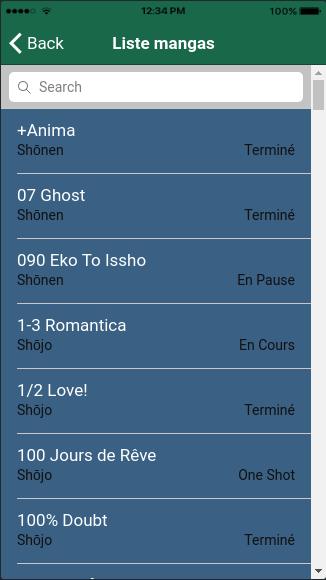
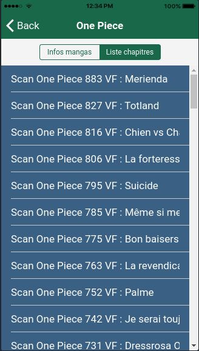

# Mangas lecture en ligne
> An Ionic - Angular application with a RESTFul webserver based on Spring

<!--  -->

<p align="center">
	
	
	
	
	
	
	
</p>

## Installation

Run server:

```sh
cd server 
mvn spring-boot:run
```
Run application:

```sh
cd client 
ionic serve --lab --port 8100 (or 4200)
```

## Meta

Medation – med.elhachimi.01@gmail.com

Distributed under the MIT license. See ``LICENSE`` for more information.

[https://github.com/medation]
